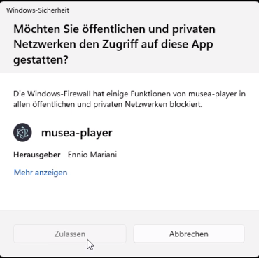
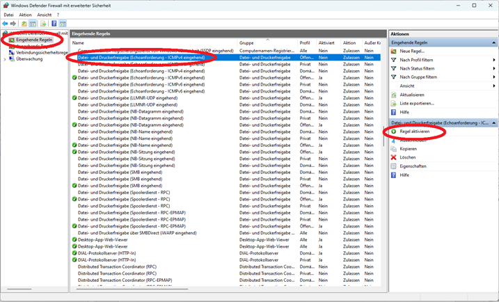

# Musea-Player
Der Standard-Medienplayer von [Musea](https://github.com/enniomariani/musea). Spielt Videos und Bilder ab und sendet Signale an DMX-Lampen.

## Start
1. [Programm herunterladen](https://github.com/enniomariani/Musea-Player/releases)
1. Einstellungen anpassen (siehe [Einstellungen](#einstellungen))
1. Firewall-Meldung akzeptieren:  
1. Windows Defender Firewall öffnen → links "erweiterte Einstellungen" anwählen   
1. Links "Eingehende Regeln" anwählen → Eintrag "Datei- und Druckerfreigabe (Echoanforderung - ICMPv4 eingehend) suchen → Regel aktivieren." 

## Einstellungen
Die Einstellungen werden in der Datei `daten/settings.txt` im JSON-Format gespeichert.

| Einstellung | Typ | Standardwert | Beschreibung                                                                                                                                     |
|-------------|-----|--------------|--------------------------------------------------------------------------------------------------------------------------------------------------|
| `Mauszeiger` | Boolean | `false`| Zeigt oder verbirgt den Mauszeiger in der Anwendung                                                                                              |
| `Vollbild` | Boolean | `true`| Startet die Anwendung im Vollbildmodus                                                                                                           |
| `COMPortDMXLicht` | String | `""`| COM-Port für die DMX-Lichtsteuerung (z.B. `"COM3"`). Leer = keine DMX-Lampe angeschlossen. Momentan unterstütztes DMX-Gerät: Enttec DMX USB Pro. |
| `InhaltRotieren180Grad` | Boolean | `false`| Dreht den angezeigten Inhalt um 180 Grad                                                                                                         |
| `PfadZumHintergrundBild` | String | `""`| Pfad zum Hintergrundbild (JPG, PNG, SVG, webP oder GIF). Der Pfad ist relativ zum Ordner `daten`)                                                |

Wenn die JSON-Datei fehlerhaft ist, werden die Standardwerte verwendet.

## Update
**Vor dem Update**
- Proramm schliessen
- Folgende Dateien/Ordner im Ordner ``alter-Programm-Ordner/resources/daten`` sichern (z.B. auf den Desktop kopieren)
  - Ordner media
  - Datei ``settings.txt``
  - Eventuell log-Dateien in logs
  - Eventuell Hintergrundbild
 
**Update**
- Neues Programm herunterladen
- Altes Programm löschen

**Nach dem Update**
- Alle gesicherten Dateien und Ordner in den Ordner ``resources/daten`` des neuen Programms kopieren (existierende Dateien überschreiben)
- Neues Programm öffnen
- Wahrscheinlich muss das geupdatete Programm nochmals in der Firewall freigegeben werden (siehe [Start](#start))

## Lizenz
Dieses Projekt steht unter der [GNU General Public License v3.0](LICENSE).

Das bedeutet: Der Code darf genutzt, verändert und weitergegeben werden, aber abgeleitete Werke müssen ebenfalls unter GPL-3.0 veröffentlicht werden.
